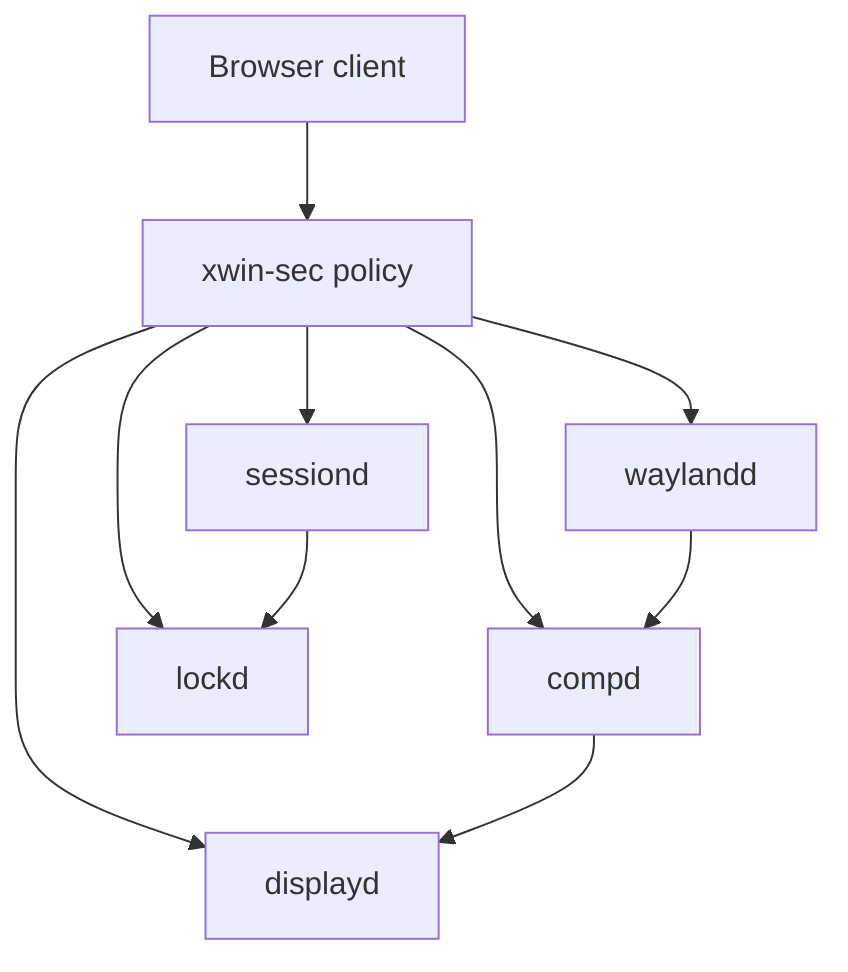

# Xwin Browser Hostile-Client Boundary

`Xwin` はブラウザを「信頼済みクライアント」ではなく、既定で hostile なクライアントとして扱う。
この文書の目的は、`Chrome/V8` のような高強度な browser renderer compromise を前提にしても、画面・入力・clipboard・file picker・screen capture・IME・GPU・compositor 境界で被害を閉じ込めることを明確化することにある。

`crates/xwin-sec/src/client.rs` は client trust model を、`crates/xwin-sec/src/capability.rs` は capability と grant scope を、`crates/xwin-sec/src/policy.rs` は browser hostile policy を定義する。
`crates/waybroker-common/src/ipc.rs` は既存の broker 間メッセージ境界であり、`Xwin` の policy 判定はこれらの surface / capability / grant に対して行う。

## Executive summary

最も重要なリスクは、compromised browser renderer が Xwin の権限境界を曖昧にし、clipboard、screen capture、drag-and-drop、IME、GPU buffer、他 surface 参照を ambient access として奪うことにある。
`Xwin` の役目は browser exploit を検出することではなく、exploit 後の権限昇格と横展開を最小権限で止めることにある。

## Scope and assumptions

- In scope:
  - `crates/xwin-sec/src/*`
  - `crates/waybroker-common/src/ipc.rs`
  - `docs/security-boundary.md`
  - `docs/architecture.md`
- Out of scope:
  - 実 `Chrome` / `V8` プロセスの監視や操作
  - browser sandbox の再実装
  - web page 内容検査
  - ExploitBench の再現
  - 実 Wayland session / 実 DRM / KMS / PipeWire / input device への接続
  - `KAIRO`, `PAL`, `CSE+` の実装
- Assumptions:
  - ブラウザ renderer は hostile とみなす
  - `Unknown` client も安全側で hostile 相当として扱う
  - browser compromise は「crash」ではなく staged exploitation として扱う
  - policy は panic せず、`DecisionReason` と `SecurityDecision` で返す

## System model

### Primary components

- `browser client`
- `xwin-sec`
- `waylandd`
- `compd`
- `displayd`
- `lockd`
- `sessiond`

### Data flows and trust boundaries

- browser client → `xwin-sec`
  - data: client identity, app identity, surface identity, requested capability, requested grant scope
  - channel: in-memory policy evaluation / future isolated transport
  - guarantees: browser は hostile、unknown も hostile 相当、入力は Result/Decision で処理
- `xwin-sec` → `waylandd` / `compd` / `displayd`
  - data: allow / deny / require-grant decision
  - channel: broker-local policy gate
  - guarantees: explicit grant がない ambient access は拒否
- `waylandd` ↔ `compd` ↔ `displayd`
  - data: surface state, focus, clipboard mediation, screen capture request, GPU buffer sharing
  - channel: repo-local IPC
  - guarantees: policy boundary は role と grant scope で切る
- `sessiond` / `lockd`
  - data: session state, lock state, degraded recovery hints
  - channel: broker-local policy and recovery state
  - guarantees: compositor compromise が session orchestration へ直結しない

#### Diagram

## Assets and security objectives

| Asset | Why it matters | Security objective |
|---|---|---|
| Clipboard contents | Secret tokens, user text, session material can leak cross-app | C |
| Screen pixels / capture output | Reveals private windows, credentials, visible secrets | C |
| Surface state / focus routing | Determines what can be read or injected | I |
| GPU buffers / shared surfaces | Can bridge memory between trust domains | C/I |
| Input routing | Can reveal or redirect user actions | C/I |
| Policy decisions / reason codes | Needed for auditability and consistent deny behavior | I/A |
| Broker integrity (`waylandd`, `compd`, `displayd`) | Prevents renderer escape from becoming compositor compromise | I/A |

## Attacker model

### Capabilities

- browser renderer compromise
- hostile browser extension or renderer-originated request
- malformed capability / grant request through a future isolated transport
- repeated probing of policy decisions

### Non-capabilities

- direct OS kernel control
- direct access to real Wayland session socket
- direct DRM/KMS/PipeWire/input device access
- browser sandbox bypass by this crate alone
- runtime exploit detection or web page inspection

## Entry points and attack surfaces

| Surface | How reached | Trust boundary | Notes | Evidence |
|---|---|---|---|---|
| `BrowserSecurityPolicy::decide` | broker-local policy call | browser → policy | core allow/deny gate | `crates/xwin-sec/src/policy.rs` |
| `PolicyContext` | capability evaluation input | client metadata → policy | source/target/focus/visible surfaces | `crates/xwin-sec/src/decision.rs` |
| `ClientProfile` | client registration / classification | app identity → trust model | browser defaults hostile | `crates/xwin-sec/src/client.rs` |
| `XwinCapability` | requested permission | request → grant/deny | enumerates clipboard, capture, IME, GPU | `crates/xwin-sec/src/capability.rs` |
| IPC envelope | broker messages | service boundary | existing JSON line / message shape | `crates/waybroker-common/src/ipc.rs` |

## Top abuse paths

1. Compromised browser renderer requests clipboard read without user action → policy denies or requires explicit grant → secret text is not exposed.
2. Renderer tries to read another surface or follow focus to a hidden window → policy rejects cross-surface read → private content stays isolated.
3. Renderer attempts screen capture as if it were ambient UI state → policy requires explicit visible grant → only intentional capture flows are allowed.
4. Renderer abuses file picker or DnD to obtain ambient filesystem scope → policy narrows the grant to selected handle only → no broad filesystem read is granted.
5. Renderer requests GPU/shared buffer access to bridge memory boundaries → policy requires explicit scope → compositor integrity stays separate.
6. Renderer injects malformed capability metadata or unknown client kind → policy returns stable deny reason instead of panicking → broker availability is preserved.
7. Renderer attempts IME leakage across windows → policy scopes IME to the focused surface only → cross-window text is denied.

## Threat model table

| Threat ID | Threat source | Prerequisites | Threat action | Impact | Impacted assets | Existing controls (evidence) | Gaps | Recommended mitigations | Detection ideas | Likelihood | Impact severity | Priority |
|---|---|---|---|---|---|---|---|---|---|---|---|---|
| TM-001 | Hostile browser renderer | Browser client is compromised | Request clipboard read without explicit grant | Secret text exfiltration | Clipboard contents | `xwin-sec` policy requires explicit grant for clipboard read | If future integration bypasses policy, leakage resumes | Enforce policy before any clipboard mediation | deny reason count for clipboard reads | high | high | high |
| TM-002 | Hostile browser renderer | Has surface references | Attempt cross-surface read or focus abuse | Private window content disclosure | Surface state, pixels | `ReadOtherSurface` deny in `crates/xwin-sec/src/policy.rs` | Grant path must stay narrow | Scope grants to explicit surface handles only | log denied cross-surface reads | high | high | high |
| TM-003 | Hostile browser renderer | User sees a page or dialog | Request screen capture as ambient capability | Screen scraping | Screen pixels | `RequestScreenCapture` requires visible grant | Visible-grant UI must remain explicit | Require visible-surface grant and user confirmation | capture-deny metrics by app id | medium | high | high |
| TM-004 | Hostile browser renderer | File picker or DnD path exists | Expand file picker or DnD into ambient filesystem access | File exfiltration / lateral movement | File handles, dropped data | `UseFilePicker` returns selected-handle scope only | Handle scope can widen if future code shortcuts policy | Mediate all file handles and DnD through capability grants | denied grant reasons by scope | medium | high | high |
| TM-005 | Hostile browser renderer | GPU or shared buffer path available | Request shared GPU buffer or compositor privilege | Memory bridge or compositor compromise | GPU buffers, broker integrity | `ShareGpuBuffer` and compositor privilege require grant | Future transport code may over-grant | Default deny shared buffer and privileged ops; log grant issuers | grant audit trail with reason codes | medium | high | high |
| TM-006 | Hostile browser renderer | IME or focused text surface exists | Leak text across windows via IME boundary | Credential or message disclosure | IME text, surface focus | `ReceiveImeText` rejects cross-window text | Focus tracking must remain correct | Keep IME scoped to focused surface only | cross-window IME deny counter | medium | medium | medium |
| TM-007 | Malformed client metadata | Parser or transport bug | Submit unknown capability / unknown client | Panic or allow-by-default | Policy availability/integrity | `decide_optional(None)` returns deny | Future callers may unwrap incorrectly | Keep policy API total, avoid unwraps, add tests | panic-free tests, deny counters | medium | high | high |

## Criticality calibration

- Critical
  - browser renderer can reach ambient clipboard read without grant
  - cross-surface read or screen capture becomes allowed by default
  - shared GPU buffers or compositor privilege can cross trust domains
- High
  - file picker or DnD expands to ambient filesystem scope
  - IME leaks text across windows
  - policy failure can become broker crash or allow-by-default
- Medium
  - explicit-grant UX is too permissive but still scoped
  - deny reasons are missing or weakly logged
  - a single client can spam denied requests for measurable noise
- Low
  - local deny paths are noisy but contained
  - the issue affects only developer-facing tests or docs

## Focus paths for security review

| Path | Why it matters | Related Threat IDs |
|---|---|---|
| `crates/xwin-sec/src/policy.rs` | Core allow/deny and grant-scope logic | TM-001, TM-002, TM-003, TM-004, TM-005, TM-006, TM-007 |
| `crates/xwin-sec/src/decision.rs` | Stable deny reasons and policy context | TM-007 |
| `crates/xwin-sec/src/client.rs` | Browser/unknown hostile defaults | TM-001, TM-002, TM-007 |
| `crates/xwin-sec/src/capability.rs` | Capability taxonomy and grant scopes | TM-001, TM-003, TM-004, TM-005 |
| `crates/waybroker-common/src/ipc.rs` | Existing broker envelope and service boundary | TM-007 |
| `docs/security-boundary.md` | Broader Xwin security boundary and runtime assumptions | TM-001..TM-007 |

## Notes from ExploitBench

ExploitBench は「クラッシュしたかどうか」ではなく、脆弱なコードへの到達、クラッシュ、primitive 構築、arbitrary read/write、最終的な code execution までを段階的に測る benchmark である。
公開された説明では 41 個の V8 バグを対象にしており、対象は Chrome/V8 系の hardened target であって、一般の web app 全体へ無制限に外挿するものではない。
Anthropic の Mythos Preview に関する記述では、browser exploit の作成に人手のヒントが含まれるケースがあり、これは完全自律の攻撃ではなく AI-assisted exploitation として扱うべきである。

Xwin は exploit の作成や検出を担当しない。
Xwin が担当するのは、compromised browser client を画面、入力、clipboard、file picker、screen capture、IME、GPU、compositor の境界で閉じ込めることだけである。

